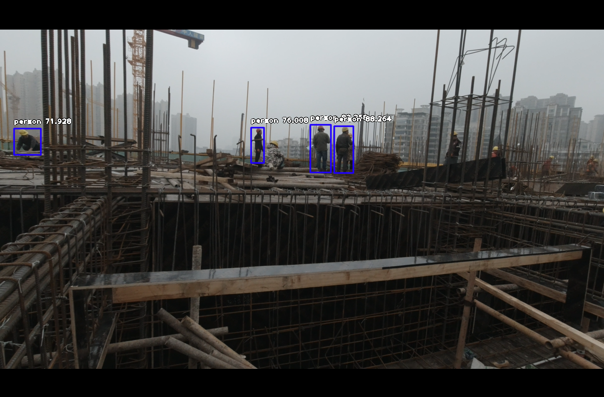

# Hat_detection(this plan has been cancelled)
a project to detect if construction worker wear safety helmet

### Prepare environment

anaconda with tensorflow

install imageai

```
pip3 install imageai --upgrade
```

IDE:pyCharm 2019.3.5

### Stage1


personDetect.py: use [trained model](https://github.com/OlafenwaMoses/ImageAI/releases/download/1.0/resnet50_coco_best_v2.0.1.h5) to detect person 



### Stage2

classify 

